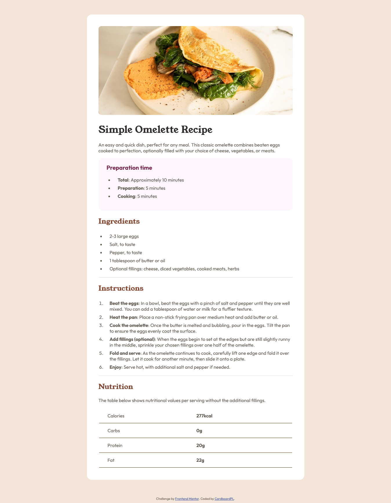
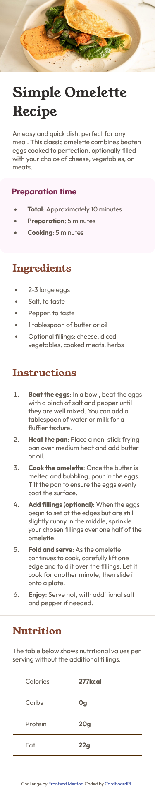

# Frontend Mentor - Recipe page solution

This is a solution to the [Recipe page challenge on Frontend Mentor](https://www.frontendmentor.io/challenges/recipe-page-KiTsR8QQKm). Frontend Mentor challenges help you improve your coding skills by building realistic projects. 

## Table of contents

- [Overview](#overview)
  - [The challenge](#the-challenge)
  - [Screenshot](#screenshot)
  - [Links](#links)
- [My process](#my-process)
  - [Built with](#built-with)
  - [What I learned](#what-i-learned)
  - [Continued development](#continued-development)
  - [Useful resources](#useful-resources)
- [Author](#author)

## Overview

### The challenge

Your challenge is to build out this recipe page and get it looking as close to the design as possible.

You can use any tools you like to help you complete the challenge. So if you've got something you'd like to practice, feel free to give it a go.

Want some support on the challenge? [Join our community](https://www.frontendmentor.io/community) and ask questions in the **#help** channel.

### Screenshot

### Links

- Solution URL: [GitHub Repo](https://github.com/CardboardPL/Frontend-Mentor-Recipe-page)
- Live Site URL: [GitHub Pages](https://cardboardpl.github.io/Frontend-Mentor-Recipe-page/)

## My process

### Built with

- Semantic HTML5 markup
- CSS
- Flexbox
- Desktop-first workflow

### What I learned

I learned on how to use downloaded fonts and practiced the HTML and CSS concepts that I have learned throughout my journey such as responsive design, flexbox, and semantic HTML5 markup.

### Continued development

I plan to use this as sort of an inspiration for my future projects.

### Useful resources

- [MDN](https://developer.mozilla.org/en-US/) - This helped me to identify the values I needed 
to achieve the design.
- [W3Schools](https://www.w3schools.com/) - This helped me to identify the HTML tags I needed 
to achieve the design.
## Author

- Frontend Mentor - [@CardboardPL](https://www.frontendmentor.io/profile/CardboardPL)
- Twitter - [@SirPLWasTaken](https://twitter.com/SirPLWasTaken)
